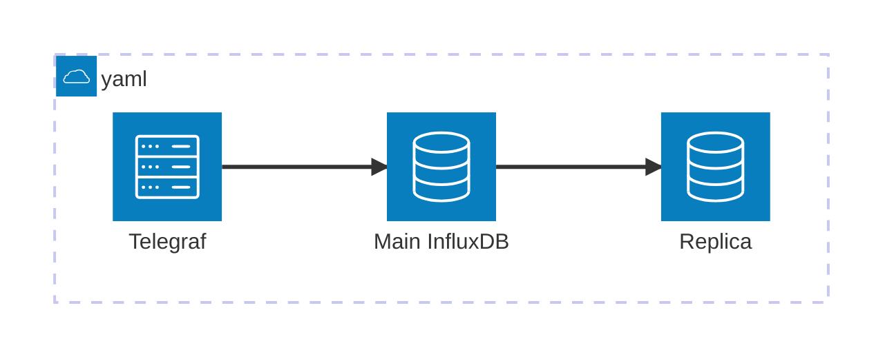

influxdb2-replication-79471652
==============================

This repository contains the code for [my answer][a] to the "question"
[Using Telegraf input for influxdb 2][q].

Usage
-----

```plaintext
git clone https://github.com/mwmahlberg/stackoverflow-answers.git mwmahlberg-so-answers
cd mwmahlberg-so-answers/influxdb2-replication-79471652
make secrets
docker-compose up -d
```




Then, you can [log in to the replica's web interface](http://localhost:8086) and
see the data that is being generated by the telegraf instance in the
[docker-compose.yaml](./docker-compose.yaml) and replicated from the main to the
replica instance.


[q]: https://stackoverflow.com/questions/79471652/using-telegraf-input-for-influxdb-2
[a]: https://stackoverflow.com/a/79598177/1296707